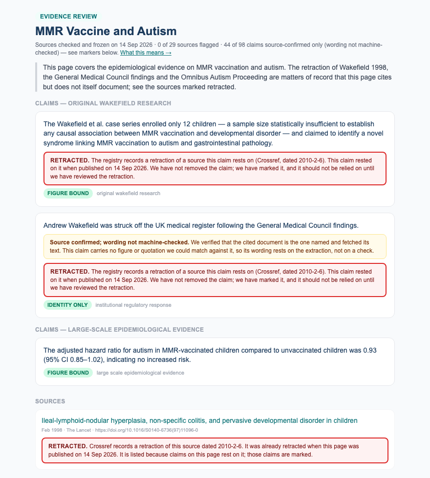

# mmr-vaccine-autism — operator read, 2026-09-14

One page, for the human read the design requires (§6a) before any flip. Record `20260914T234750+0000-c9b4fdd`, gate `c9b4fdd`. **29 of 35 sources survive; 54 claims figure-bound, 44 source-confirmed only, 30 withheld.** Wakefield 1998 survives identity and is marked RETRACTED from day one; Cochrane pub4 is marked superseded; Jain 2015 carries a JAMA correction. Full detail: `docs/mmr-vaccine-autism-survival-read-2026-09-14.md`.

**Sign-off:** the freeze register has a pending row. Reader name, date and ruling go there either way.

## 1. The scope statement, exactly as it will appear under the title

> This page covers the epidemiological evidence on MMR vaccination and autism. The retraction of Wakefield 1998, the General Medical Council findings and the Omnibus Autism Proceeding are matters of record that this page cites but does not itself document; see the sources marked retracted.

## 2. Ten IDENTITY_ONLY claims, weakest first — the page will show each with *"Source confirmed; wording not machine-checked"*

- Andrew Wakefield was struck off the UK medical register following the General Medical Council findings.  
  ← Ileal-lymphoid-nodular hyperplasia, non-specific
- The UK General Medical Council found that the Wakefield et al. research involved undisclosed financial conflicts of interest, ethical violations in the treatment of child subjects (including invasive procedures without ethical approval), data manipulation, and dishonesty — constituting serious professional misconduct.  
  ← Ileal-lymphoid-nodular hyperplasia, non-specific
- The Wakefield et al. study was found to have involved data manipulation, undisclosed conflicts of interest, and ethical violations in subject recruitment.  
  ← Ileal-lymphoid-nodular hyperplasia, non-specific
- The Madsen et al. Danish cohort study was published in the New England Journal of Medicine.  
  ← A Population-Based Study of Measles, Mumps, and 
- The biological mechanisms proposed by Wakefield — including measles virus persistence in gut tissue and 'leaky gut' leading to neurological damage — were not supported by credible scientific evidence, according to the Institute of Medicine's Immunization Safety Review Committee.  
  ← Immunization Safety Review: Vaccines and Autism; Immunization Safety Review: Vaccines and Autism 
- ACIP recommendations carry regulatory weight as they inform the Vaccines for Children program and state immunization mandates.  
  ← Advisory Committee on Immunization Practices (AC
- Anti-vaccine advocates conflated concerns about thimerosal with the separate MMR-autism hypothesis advanced by Wakefield.  
  ← FDA Statement Regarding the MMR Vaccine and Thim
- The EMA's EPAR notes that the original Wakefield hypothesis was not substantiated by subsequent large-scale epidemiological studies conducted in Europe, including the Danish cohort study by Madsen et al.  
  ← European Medicines Agency: M-M-RvaxPro — Europea
- The Institute of Medicine's Immunization Safety Review Committee concluded that the epidemiological evidence consistently and convincingly favors rejection of a causal relationship between MMR vaccine and autism.  
  ← Immunization Safety Review: Vaccines and Autism 
- The Taylor et al. meta-analysis found no relationship between thimerosal or mercury-containing vaccines and autism.  
  ← Vaccines are not associated with autism: An evid

The first three rest on the retracted 1998 paper, which cannot contain the GMC's findings about itself — they are true statements attached to the wrong document, and the page will show them source-confirmed. The fourth is trivia. The others are agency prose the fetch confirms exists but no figure or quotation anchors. These are what the metric is for.

## 3. All 30 withheld claims, one line each

- The Omnibus Autism Proceeding ruling rejected both the 'MMR plus thimerosal' causation theory and the standalone MMR-autism theory, finding that epide…  
  WHY: source unretrievable: Omnibus Autism Proceeding: Special Mas (fetch: HTTP 404)
- The Honda et al. Japan study is considered one of the strongest natural experiments disproving a causal link between MMR vaccine and autism.  
  WHY: figure not in abstract: 1
- Among children with an older sibling with ASD, MMR vaccination was not associated with increased autism risk, with a hazard ratio of 0.80 (95% CI 0.55…  
  WHY: figure not in abstract: 0.55, 0.8, 1.16, 95
- The Danish cohort study found no temporal clustering of autism diagnoses in the 2-year period following MMR vaccination.  
  WHY: figure not in abstract: 2
- A UK cohort study examined 498 children with autism spectrum disorder born between 1979 and 1998 in the North Thames region.  
  WHY: figure not in abstract: 1998
- A Danish cohort study followed 537,303 children born between 1991 and 1998, comparing autism rates between 440,655 MMR-vaccinated and 96,648 unvaccina…  
  WHY: figure not in abstract: 96648
- The relative risk of autism in MMR-vaccinated children compared to unvaccinated children was 0.92 (95% CI, 0.68–1.26), indicating no increased risk of…  
  WHY: figure not in abstract: 1.26
- Among children born in Yokohama between 1992 and 1996, the cumulative incidence of autism by age 7 rose from 48.4 to 117.2 per 10,000, despite zero MM…  
  WHY: figure not in abstract: 0, 10000, 117.2, 48.4
- Autism prevalence in Yokohama continued to rise after MMR vaccination rates dropped to zero following the 1993 withdrawal of the vaccine in Japan.  
  WHY: figure not in abstract: 0
- Andrew Wakefield had been paid by lawyers seeking evidence against vaccine manufacturers at the time of the original 1998 research.  
  WHY: source unretrievable: Retraction—Ileal-lymphoid-nodular hype (publisher: HTTP 200 a shell, a wall or too little text to be the document)
- Wakefield's data alterations in the 1998 Lancet paper included changing documented diagnoses and onset timelines across all 12 cases to fit the hypoth…  
  WHY: source unretrievable: How the Case Against the MMR Vaccine W (publisher: HTTP 403 )
- The cumulative incidence of autism spectrum disorders in Yokohama rose from 47.6 per 10,000 in the 1988 birth cohort to 117.2 per 10,000 in the 1996 b…  
  WHY: figure not in abstract: 10000, 117.2, 47.6
- The relative risk of autistic disorder in MMR-vaccinated children compared to unvaccinated children was 0.92 (95% CI, 0.68–1.26), indicating no statis…  
  WHY: figure not in abstract: 1.26
- The Danish cohort study included 440,655 MMR-vaccinated children and 96,648 unvaccinated children, finding no statistically significant difference in …  
  WHY: figure not in abstract: 2, 96648
- A UK-based cohort study examined 498 children with autism or atypical autism born between 1979 and 1992 in the North Thames region to analyze the temp…  
  WHY: figure not in abstract: 1992
- The temporal clustering of autism diagnoses with MMR vaccination timing reflects the coincidence of the 12–18 month vaccination window with the typica…  
  WHY: figure not in abstract: 12, 18
- Japan withdrew the MMR vaccine in 1993, resulting in MMR vaccination rates dropping to zero after that year.  
  WHY: figure not in abstract: 0
- M-M-R II (BLA 103166), manufactured by Merck & Co., has maintained FDA licensure continuously since 1978 with periodic label updates.  
  WHY: source unretrievable: Biologics License Application (BLA) 10 (fetch: HTTP 404)
- FDA product labeling for M-M-R II lists known adverse reactions including fever, rash, and rare febrile seizures, but does not list autism spectrum di…  
  WHY: source unretrievable: Biologics License Application (BLA) 10 (fetch: HTTP 404)
- Post-marketing safety update reviews of M-M-R II conducted by FDA's Center for Biologics Evaluation and Research (CBER) have not identified a causal s…  
  WHY: source unretrievable: Biologics License Application (BLA) 10 (fetch: HTTP 404)
- The Omnibus Autism Proceeding involved approximately 5,500 claims filed in the Vaccine Injury Compensation Program alleging that MMR vaccination cause…  
  WHY: source unretrievable: Omnibus Autism Proceeding: Special Mas (fetch: HTTP 404)
- Special Master George Hastings ruled that petitioners had not demonstrated by a preponderance of evidence that MMR vaccine caused autism in the test c…  
  WHY: source unretrievable: Omnibus Autism Proceeding: Special Mas (fetch: HTTP 404)
- The Lancet issued a full retraction of the Wakefield et al. MMR-autism paper in February 2010.  
  WHY: figure not in abstract: 2010; source unretrievable: Retraction—Ileal-lymphoid-nodular hype (publisher: HTTP 200 a shell, a wall or too little text to be the document)
- Andrew Wakefield was struck off the UK medical register in May 2010.  
  WHY: figure not in abstract: 2010; source unretrievable: Retraction—Ileal-lymphoid-nodular hype (publisher: HTTP 200 a shell, a wall or too little text to be the document)
- Wakefield received £435,643 plus expenses from lawyers seeking to build a case against MMR vaccine manufacturers prior to publication of the 1998 Lanc…  
  WHY: figure not in abstract: 435643; source unretrievable: How the Case Against the MMR Vaccine W (publisher: HTTP 403 )
- Special Master Hastings characterized the scientific evidence presented by petitioners — including testimony based on Wakefield's research — as 'weak,…  
  WHY: source unretrievable: Omnibus Autism Proceeding: Special Mas (fetch: HTTP 404)
- The retraction of the Wakefield et al. paper removed the primary published basis for the MMR-autism hypothesis.  
  WHY: source unretrievable: Retraction—Ileal-lymphoid-nodular hype (publisher: HTTP 200 a shell, a wall or too little text to be the document)
- Ten of the thirteen co-authors of the Wakefield et al. paper formally withdrew their names from the paper's interpretation in 2004.  
  WHY: figure not in abstract: 13, 2004
- Brian Deer's BMJ investigation found that Wakefield altered clinical data from all 12 children in the 1998 Lancet paper, with every case where records…  
  WHY: source unretrievable: How the Case Against the MMR Vaccine W (publisher: HTTP 403 )
- The BMJ formally characterized the 1998 Lancet paper by Wakefield as 'an elaborate fraud' in an editorial by editor Fiona Godlee, marking the first ti…  
  WHY: source unretrievable: How the Case Against the MMR Vaccine W (publisher: HTTP 403 )

## 4. A claim carrying the Wakefield marker, in page context

Rendered from the record with the approved wording (static render; the live page uses the same classes and text):

