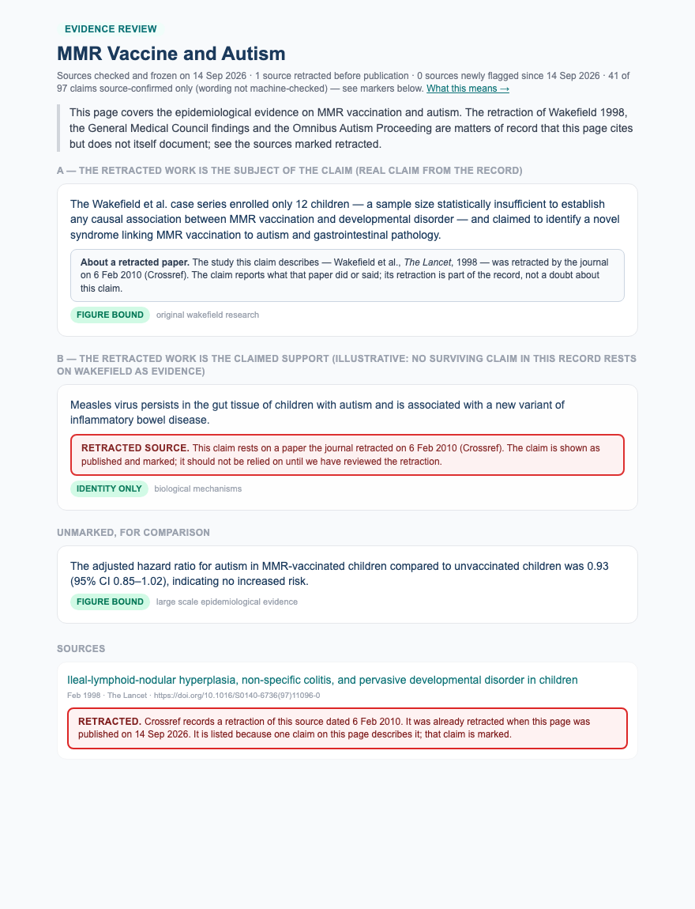

# mmr-vaccine-autism — operator read, 2026-09-15 (final, record ec9ac08)

One page, for the human read the design requires (§6a) before any flip. Record `20260915T212024+0000-ec9ac08`, gate `ec9ac08`, stored in `topic_publications` and served to the draft page. This is the build finished: CHRONOLOGY, the publish gate on already-changed sources, the erratum precision check, the two retracted markers, the corpus corrections 081–083 and 090–092, the six refused plain summaries (088–089), the word-form figure rule, four hand-fetched documents admitted under `OPERATOR_SUPPLIED`, the date-only levelling fix, and the operator's withhold register.

**34 of 38 sources survive · 34 claims figure-bound · 1 quotation-bound · 68 source-confirmed only (53%) · 25 withheld.** Status of survivors at freeze: Wakefield 1998 ×2 retracted (subject-only on the page), Jain 2015 ×2 corrected (JAMA erratum), the Lancet retraction notice (a `retraction_notice` about Wakefield 1998), 7 documents with no status registry (6 agency/payer pages and the Walker-Smith judgment), 22 unchanged — among them Godlee's editorial, which Crossref calls `unchanged` although the BMJ corrected it (the correction is on this record as its own source, and the scope statement says so). **Four survivors were fetched by a person, not the machine**, and the record says so on each: the Lancet retraction notice (sha256 `b70a2200…`), Deer's BMJ investigation (`79373a9f…`), Godlee's BMJ editorial (`f58bdbdd…`) and the BMJ's correction to it (`953b3c50…`), all supplied by Fred Ugast on 2026-09-15 after the registry's title was found in the file.

**Four claims are withheld by the operator, not by the gate**, and UNSUPPORTED rose from 21 to 25 for that reason and no other. Their content is not in their source: `b8b27c3b` Madsen "no dose-response" (no dose analysis in the abstract); `6bbf8769` Hviid "preterm birth or low birth weight" (not in the abstract); `62c10907` Cochrane "published in 2020 … described as the most comprehensive" (pub5 is 2021; nobody describes it so); `f0b091fa` "Smeeth 2004 … no evidence of temporal clustering" — the finding is Taylor 1999's ("no temporal association between onset of autism within 1 or 2 years after vaccination"), but the claim names Smeeth in its own words, so it is withheld rather than re-cited. The rule applied: when a claim's content is not in its source, withhold the claim; do not go looking for a source that fits it. The record carries who ruled, when, and what was read (`operator_withheld` on each). Nothing else changed level between the previous record and this one.

**On the figure-bound count** (unchanged from the previous record, restated so no one reads it against the 14 September read): 34 figure-bound plus one quotation-bound, down from a 64 that had counted 29 claims bound on a year alone. That drop was the fix working, not a regression; what the page shows did not change with it.

> Records before this one today: `a42989d` (34/1/72/21 — the levelling fix and 091), `4fefcb5` (090), `0e25a32` (the notice and Deer admitted), `22387c7` (the word-form fix), `b902246` (Europe PMC stopped answering; kept, not signed).

**Sign-off:** the freeze register has a pending row. Reader name, date and ruling go there either way.

## What changed since the 14 Sep read

* **Migration 092 (applied):** the BMJ's competing-interests correction to Godlee's editorial (bmj.d1678) is a source, titled "Correction — …", admitted from Fred's hand-fetched copy for its own DOI; the editorial's row records `corrected_by` citing that admitted document. Crossref reports the editorial `unchanged`; the page says otherwise in the scope statement. No status marker is built for it tonight (Phase 5: a hand-curated marker must look different from a registry's).
* **Four claims withheld by the operator** (box above).
* **Date-only claims are source-confirmed, not figure-bound** (gate a42989d). See the box above: 29 claims relabelled, one false bind found and re-cited (091), four more named for the operator.
* **Migration 090 (applied 2026-09-15):** Godlee's BMJ editorial (bmj.c7452) is a source; the 'an elaborate fraud' claim is re-cited from Deer's feature, which does not contain the phrase, to the editorial the claim names. **Observed, not expected:** SPAN found `an elaborate fraud` in the stored text of the editorial, once, at character 2043 — *"to show that the paper was in fact an elaborate fraud"* — and bound; the claim is now shown. Walker-Smith v General Medical Council [2012] EWHC 503 (Admin) is a source (fetched by machine from The National Archives, 223k characters, `no_registry` status), linked to no claim: which claims it qualifies is the operator's wording decision (section 1a).
* **Two documents the machine could not get were fetched by hand and admitted** (`verify/supplied.py`): the Lancet retraction notice (Elsevier serves the machine a shell) and Deer's BMJ investigation (403). Admission required the registry's title to be found in the file; binding then ran unchanged. The notice recovers "paid by lawyers … 1998" (figure-bound on the date), "full retraction … in February 2010" (month precision; "struck off in May 2010" stays withheld — the notice predates it), and two identity-only claims (the GMC findings; "removed the primary published basis"). Deer recovers the £435,643, the "all 12 children" data-alteration claims. The notice says "incorrect" and "proven to be false", not fraud; nothing on the page makes it say more. 'an elaborate fraud' is Godlee's editorial, not Deer's feature: SPAN refused it against Deer and it waits on migration 090.
* **A bare "one" or "zero" in a claim is no longer a figure** (gate 7338993). "one of the strongest natural experiments" is an article; "vaccination rates dropping to zero" asserts absence. Three claims recover: the Honda "strongest natural experiments" claim (source-confirmed only), and the two Yokohama "dropped to zero after the 1993 withdrawal" claims (figure-bound). The fourth, "…rose from 48.4 to 117.2 per 10,000, despite zero MMR vaccination", stays withheld — for the right reason now: 48.4, 117.2 and 10,000 are not in the abstract. No bound claim became unbound. "one dose", "zero cases" and every other counting word are unchanged.
* **Two withholdings re-described** (section 3): the RR 0.92 claims say the upper bound is 1.26; Madsen 2002's abstract says 1.24. That is not a retrieval limit — the claim's figure disagrees with the source's — and it is the gate's best result on this record.
* **Six plain summaries removed** (088, 089): four added a fact the claim and source do not carry, one computed an interval the summariser was never handed, one sat on a withheld claim. The claims render without them.
* **Cochrane cited at pub5** (migration 083; DOI from Crossref's own update-to, not typed). All nine claims re-bind against the current review — 5 figure-bound (138 studies; 23,480,668 participants; 95% and 96% measles risk reduction), 4 source-confirmed. None was refused, so the refusal on pub4 was a citation problem and nothing more. One wording defect no gate can catch: the sentence "The Cochrane systematic review … published in 2020" now cites the 2021 version; it should say 2021 or drop the date.
* **Erratum precision** (support links only): the erratum is fetched and asked whether it mentions a figure the claim asserts. For Jain 2015 the erratum — *"Incorrect Variable Description"*, JAMA 2016, `10.1001/jama.2015.17754` — is behind JAMA's Cloudflare wall and Europe PMC holds no text, so it **cannot be read, and the check fails closed**: the two support-link claims (the sibling HR 0.80 findings) stay withheld with that reason. Six Jain claims that name the study are subject links and pass. Its title suggests a variable-description fix, not a figure — but a title is not the text, and the rule does not guess. A reviewer who can open the erratum can settle it in a minute.
* **CHRONOLOGY:** the three GMC / struck-off claims are withheld — true, but the 1998 paper cannot contain the GMC's 2010 findings.
* The red RETRACTED marker now only ever means "changed after we froze it"; at freeze a retracted paper appears only as the subject of a claim, with a grey information note.

## 1. The scope statement — proposed for the page, checked against this record

The statement is not yet rendered anywhere; it appears only here until the operator settles the wording. Checked against record `4fefcb5`, the operator's proposed text with three adjustments (marked):

> This page covers the epidemiological evidence on MMR vaccination and autism, and the retraction of Wakefield 1998, documented here from The Lancet's own retraction notice and from the BMJ's investigation **and editorial**. The General Medical Council's findings and the Omnibus Autism Proceeding are matters of record that this page cites but does not itself document: the GMC determination and the Special Master's decision are not machine-retrievable, and **what appears here about the GMC is what The Lancet's notice says of the panel's judgment of 28 January 2010**. **The High Court's 2012 judgment quashing the GMC's findings against Professor Walker-Smith is on record here. The BMJ published a competing-interests correction to its editorial — the journal had not declared advertising and sponsorship revenue from Merck and GSK, both MMR manufacturers — and that correction is on record here too.**

What was checked, and what changed:
- *"documented here from The Lancet's own retraction notice"* — true: the notice is admitted (`b70a2200…`), the retraction claim (`77c65493`, "February 2010") is bound on it at month precision, and "struck off in May 2010" is refused against it.
- *"and the BMJ's investigation"* — true for Deer's findings: 12 children altered (`9b7a3312`, `1f6b6c20`) and £435,643 (`58b05989`) are figure-bound on Deer's text. **Added "and editorial"**: the fraud characterisation (`0eda21d2`, 'an elaborate fraud') is Godlee's editorial, SPAN-bound on it since 090, not Deer's feature.
- *"nothing verifiable stands in for them"* — **no longer accurate in one direction**: the notice's sentence about the GMC panel's judgment is verifiable and admitted, and `721f53f7` (the GMC found …) now renders on it, source-confirmed only. The replacement says exactly what stands in and how far it goes.
- *"cites but does not itself document"* the GMC — still true: the 143-page determination is on Fred's disk with no URL and no registry; it is not a source.
- **Added the Walker-Smith sentence** because the corpus now holds the judgment; without it the page would carry GMC findings on ethics approval while silently holding the judgment that quashed them for one of the three doctors. The operator decides whether it stays.
- **Added the fourth sentence (the operator's instruction, 2026-09-15):** the BMJ's correction bmj.d1678 to Godlee's editorial. Crossref reports c7452 `unchanged`, so nothing machine-side would ever have surfaced it; a reader who finds it will ask why the page did not. It is in the corpus by **migration 092 (applied)** — the correction as its own source, titled "Correction — …", admitted from the hand-fetched copy, and the editorial's row carrying `corrected_by` that cites the admitted document. The sentence and the record agree.
- Not in the statement and not documented: the Omnibus/Cedillo claims (4, all withheld); the FDA BLA claims (3, withheld).

### 1a. Claims that need qualifying against Walker-Smith v GMC (the operator's wording call)

- `721f53f7` — "The UK General Medical Council found that the **Wakefield et al.** research involved … ethical violations in the treatment of child subjects (including invasive procedures without ethical approval), data manipulation, and dishonesty" — renders, source-confirmed, on the notice. The ethics-approval and treatment findings were principally against Walker-Smith and were quashed in 2012; "dishonesty" was found against Wakefield alone.
- `08ba751e` — "The **Wakefield et al.** study was found to have involved data manipulation, undisclosed conflicts of interest, and ethical violations in subject recruitment" — withheld (CHRONOLOGY against Wakefield 1998); same shape if it is ever re-cited.
- Wakefield-only, no qualification: `fb149d23`, `05143523`, `5b3bff25`.

## 2. Thirteen IDENTITY_ONLY claims, weakest first (of 68 — 29 of them relabelled from figure-bound today) — each will carry *"Source confirmed; wording not machine-checked"*

- The UK General Medical Council found that the Wakefield et al. research involved undisclosed financial conflicts of interest, ethical violations in the treatment of child subjects (including invasive procedures without ethical approval), data manipulation, and dishonesty — constituting serious professional misconduct.  
  ← Retraction—Ileal-lymphoid-nodular hyperplasia… (The Lancet, 2010)  *(recovered on the hand-fetched notice; the notice says "incorrect" and "proven to be false" about consecutive referral and ethics approval — it does not say "data manipulation" or "dishonesty", and the GMC findings on ethics approval were quashed for Walker-Smith in 2012: see the wording list)*
- The retraction of the Wakefield et al. paper removed the primary published basis for the MMR-autism hypothesis.  
  ← Retraction—Ileal-lymphoid-nodular hyperplasia… (The Lancet, 2010)  *(recovered; editorial framing — the notice retracts, it does not say what the paper was the basis of)*
- The Honda et al. Japan study is considered one of the strongest natural experiments disproving a causal link between MMR vaccine and autism.  
  ← No effect of MMR withdrawal on the incidence of autism: a total population study  *(recovered at gate 7338993; "one of" was read as a figure)*
- The Madsen et al. Danish cohort study was published in the New England Journal of Medicine.  
  ← A Population-Based Study of Measles, Mumps, and 
- The Danish cohort study on MMR vaccination and autism was published in Annals of Internal Medicine.  
  ← Measles, Mumps, Rubella Vaccination and Autism: 
- ACIP recommendations carry regulatory weight as they inform the Vaccines for Children program and state immunization mandates.  
  ← Advisory Committee on Immunization Practices (AC
- The Institute of Medicine convened an independent Immunization Safety Review Committee that conducted a comprehensive review of all available epidemiological and biological evidence on the MMR–autism and thimerosal–autism hypotheses, and is described as the most authoritative U.S. government-commissioned scientific review of the MMR-autism controversy.  
  ← Immunization Safety Review: Vaccines and Autism; Immunization Safety Review: Vaccines and Autism 
- Anti-vaccine advocates conflated concerns about thimerosal with the separate MMR-autism hypothesis advanced by Wakefield.  
  ← FDA Statement Regarding the MMR Vaccine and Thim
- M-M-R II has never contained thimerosal as a preservative; the vaccine uses a live attenuated formulation incompatible with preservative use.  
  ← FDA Statement Regarding the MMR Vaccine and Thim
- The EMA's EPAR notes that the original Wakefield hypothesis was not substantiated by subsequent large-scale epidemiological studies conducted in Europe, including the Danish cohort study by Madsen et al.  
  ← European Medicines Agency: M-M-RvaxPro — Europea
- Multiple large-scale epidemiological studies reviewed by ACIP found no association between MMR vaccination and autism spectrum disorder.  
  ← Advisory Committee on Immunization Practices (AC
- The Institute of Medicine's Immunization Safety Review Committee concluded that the epidemiological evidence consistently and convincingly favors rejection of a causal relationship between MMR vaccine and autism.  
  ← Immunization Safety Review: Vaccines and Autism 
- The biological mechanisms proposed by Wakefield — including measles virus persistence in gut tissue and 'leaky gut' leading to neurological damage — were not supported by credible scientific evidence, according to the Institute of Medicine's Immunization Safety Review Committee.  
  ← Immunization Safety Review: Vaccines and Autism; Immunization Safety Review: Vaccines and Autism 

Trivia ("was published in…"), editorial framing ("anti-vaccine advocates conflated…", "carry regulatory weight", "one of the strongest"), and agency prose the fetch confirms exists but nothing anchors. 53% after the relabelling and the four withholds (34% before); the number to bring down is the same set of sentences it always was — the relabelling moved claims between tiers, not onto the page.

## 3. All 25 withheld claims, one line each

- The Omnibus Autism Proceeding ruling rejected both the 'MMR plus thimerosal' causation theory and the standalone MMR-autism theory, finding that epid…  
  WHY: source unretrievable: Omnibus Autism Proceeding: Special M (fetch: HTTP 404); SOURCE: fetch: HTTP 404
- Among children with an older sibling with ASD, MMR vaccination was not associated with increased autism risk, with a hazard ratio of 0.80 (95% CI 0.5…  
  WHY: ERRATUM unreadable: erratum text could not be read (unretrievable (publisher HTTP 203)); it cannot b
- The Danish cohort study found no temporal clustering of autism diagnoses in the 2-year period following MMR vaccination.  
  WHY: figure not in abstract: 2
- A Danish cohort study followed 537,303 children born between 1991 and 1998, comparing autism rates between 440,655 MMR-vaccinated and 96,648 unvaccin…  
  WHY: figure not in abstract: 96648
- The Madsen 2002 Danish cohort study found no dose-response relationship between MMR vaccination and autism.  
  WHY: **withheld by the operator** — asserts a finding the study did not make: 'no dose-response relationship' -- Madsen 2002 compared vaccinated with unvaccinated children; the fetched abstract contains no dose analysis (the word 'dose' does not appear)
- Among children born in Yokohama between 1992 and 1996, the cumulative incidence of autism by age 7 rose from 48.4 to 117.2 per 10,000, despite zero M…  
  WHY: figure not in abstract: 10000, 117.2, 48.4
- The relative risk of autism in MMR-vaccinated children compared to unvaccinated children was 0.92 (95% CI, 0.68–1.26), indicating no increased risk o…  
  WHY: **the source states a different value** — Madsen 2002 (NEJM) abstract: 0.92 (95% CI, 0.68 to **1.24**); the claim says **1.26**. The claim's figure disagrees with the source's and the gate refused it correctly; it stays withheld until the sentence is corrected.
- The Smeeth 2004 case-control study found no evidence of temporal clustering of pervasive developmental disorder diagnoses following MMR vaccination.  
  WHY: **withheld by the operator** — attributes to Smeeth 2004 a finding that is Taylor 1999's ('no temporal association between onset of autism within 1 or 2 years after vaccination'; 'no significant temporal clustering for age at onset of parental concern ... with the exception of a single interval within 6 months'). The finding exists, but the claim names the wrong study IN ITS OWN WORDS, so a re-cite would put a 'Smeeth 2004' sentence under a Taylor 1999 citation; and Taylor's finding carries an exception the claim does not. Withheld; the wording is the operator's to change.
- FDA product labeling for M-M-R II lists known adverse reactions including fever, rash, and rare febrile seizures, but does not list autism spectrum d…  
  WHY: source unretrievable: Biologics License Application (BLA)  (fetch: HTTP 404); SOURCE: fetch: HTTP 404
- The Cochrane systematic review on MMR vaccine safety, published in 2020, is described as the most comprehensive systematic review on MMR vaccine safe…  
  WHY: **withheld by the operator** — asserts a description the source does not carry: 'published in 2020, is described as the most comprehensive systematic review on MMR vaccine safety to date' -- the cited version is pub5 (22 Nov 2021); 'comprehensive' does not appear; 'described as' by no one in the text
- The cumulative incidence of autism spectrum disorders in Yokohama rose from 47.6 per 10,000 in the 1988 birth cohort to 117.2 per 10,000 in the 1996 …  
  WHY: figure not in abstract: 10000, 117.2, 47.6
- Ten of the thirteen co-authors of the Wakefield et al. paper formally withdrew their names from the paper's interpretation in 2004.  
  WHY: CHRONOLOGY: explicit date 2004
- Children with an older autistic sibling showed no increased autism risk from MMR vaccination, refuting concerns about genetically susceptible subgrou…  
  WHY: ERRATUM unreadable: erratum text could not be read (unretrievable (publisher HTTP 203)); it cannot b
- The relative risk of autistic disorder in MMR-vaccinated children compared to unvaccinated children was 0.92 (95% CI, 0.68–1.26), indicating no stati…  
  WHY: **the source states a different value** — Madsen 2002 (NEJM) abstract: 0.92 (95% CI, 0.68 to **1.24**); the claim says **1.26**. The claim's figure disagrees with the source's and the gate refused it correctly; it stays withheld until the sentence is corrected.
- The Danish cohort study included 440,655 MMR-vaccinated children and 96,648 unvaccinated children, finding no statistically significant difference in…  
  WHY: figure not in abstract: 2, 96648
- The Hviid 2019 Danish cohort study found no increased autism risk in high-risk subgroups including children with preterm birth or low birth weight wh…  
  WHY: **withheld by the operator** — asserts a finding the study did not make: 'high-risk subgroups including children with preterm birth or low birth weight' -- Hviid 2019's fetched abstract defines subgroups by sibling history and 'autism risk factors (based on a disease risk score)'; neither 'preterm' nor 'birth weight' appears
- The temporal clustering of autism diagnoses with MMR vaccination timing reflects the coincidence of the 12–18 month vaccination window with the typic…  
  WHY: figure not in abstract: 12, 18
- M-M-R II (BLA 103166), manufactured by Merck & Co., has maintained FDA licensure continuously since 1978 with periodic label updates.  
  WHY: source unretrievable: Biologics License Application (BLA)  (fetch: HTTP 404); SOURCE: fetch: HTTP 404
- Post-marketing safety update reviews of M-M-R II conducted by FDA's Center for Biologics Evaluation and Research (CBER) have not identified a causal …  
  WHY: source unretrievable: Biologics License Application (BLA)  (fetch: HTTP 404); SOURCE: fetch: HTTP 404
- The Omnibus Autism Proceeding involved approximately 5,500 claims filed in the Vaccine Injury Compensation Program alleging that MMR vaccination caus…  
  WHY: source unretrievable: Omnibus Autism Proceeding: Special M (fetch: HTTP 404); SOURCE: fetch: HTTP 404
- Special Master George Hastings ruled that petitioners had not demonstrated by a preponderance of evidence that MMR vaccine caused autism in the test …  
  WHY: source unretrievable: Omnibus Autism Proceeding: Special M (fetch: HTTP 404); SOURCE: fetch: HTTP 404
- Andrew Wakefield was struck off the UK medical register following the General Medical Council findings.  
  WHY: CHRONOLOGY: General Medical Council fitness-to-practise determination on Wakefield, Walker-S
- Andrew Wakefield was struck off the UK medical register in May 2010.  
  WHY: CHRONOLOGY: explicit date 2010-05
- The Wakefield et al. study was found to have involved data manipulation, undisclosed conflicts of interest, and ethical violations in subject recruit…  
  WHY: CHRONOLOGY: General Medical Council fitness-to-practise determination on Wakefield, Walker-S
- Special Master Hastings characterized the scientific evidence presented by petitioners — including testimony based on Wakefield's research — as 'weak…  
  WHY: source unretrievable: Omnibus Autism Proceeding: Special M (fetch: HTTP 404); SOURCE: fetch: HTTP 404

## 4. The two retracted markers, in page context

A — the retracted work is the subject (the only surviving Wakefield-linked claim; grey note). B — the support case, illustrative: no claim on this record rests on a retracted source, so B can only appear from a re-check after publication (red block).

## 5. Link roles — the audit trail

63 subject links, 62 support links, each with the rule that fired on the record (first author's surname, or the title word — `thimerosal`, `montreal`, `withdrawal`, `regression`, `siblings`, `pervasive`, `medicines` — or nothing). The title-word matches are the ones to watch; each is traceable to the word.
